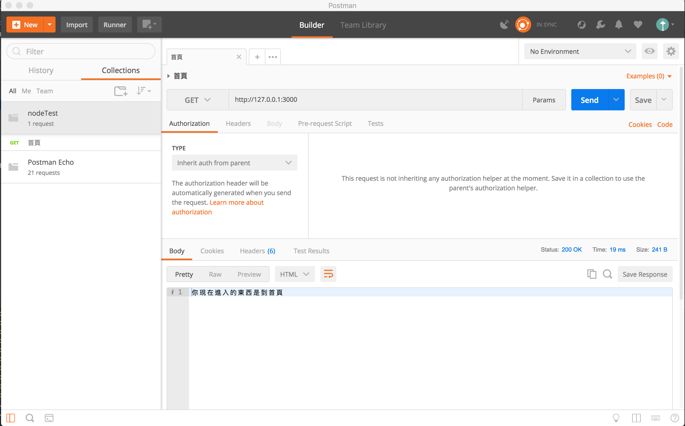
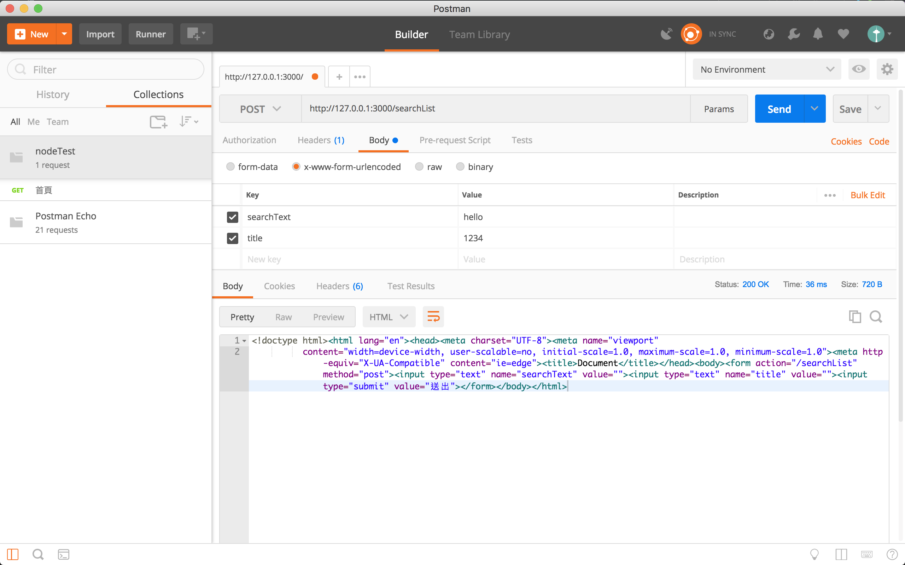
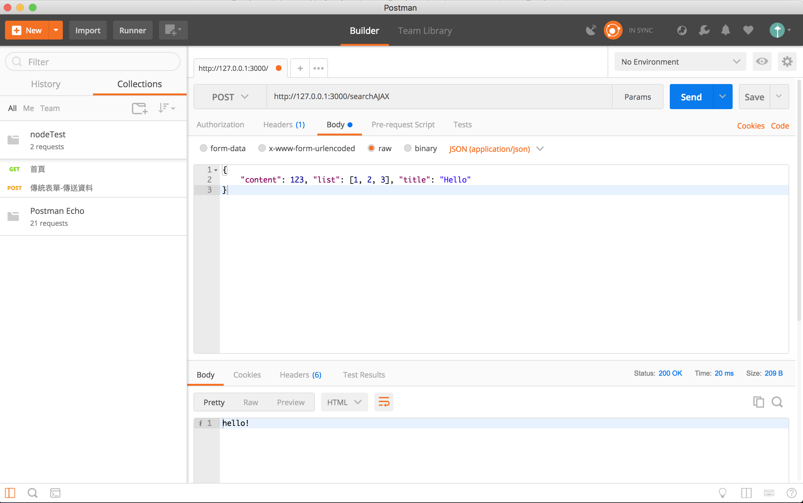

# 學習 Express

## Express 框架介紹

> Node.js 輕量型 web 應用框架

### 資料庫：

- firebase
- mongo
- mysql

### Template：

- EJS
- Jade (Pug)

## Express 環境安裝

```shell
mkdir project
cd project
npm init -y
npm i express --save
```

## 開啟 web 伺服器

```javascript
// app.js
var express = require('express');
var app = express(); // 取得 express 所有功能

app.get('/', function (req, res) {
  // res.send('1234'); // 傳送資料
  res.send('<html><head></head><body><h1>Hi!</h1></body></html>');
});

// 監聽 port
var port = process.env.PORT || 3000; // 雲端伺服器會預設幫你找一個 port
app.listen(port);
```

```shell
node app.js
```

## 網址規則介紹

設計 router 路由：

http 傳輸協定 + sub domain + domain + PORT + 路徑 + 參數 (Query)

## 路由設計

### 固定網址路徑

```javascript
app.get('/user/edit-profile', function (req, res) {
  res.send('<html><head></head><body><h1>profile</h1></body></html>');
});

app.get('/user/edit-photo', function (req, res) {
  res.send('<html><head></head><body><h1>photo</h1></body></html>');
});
```

### 動態網址路徑

路徑帶 參數 給 node.js 取得資料後跟資料庫溝通，完成後在 render 結果

## params - 取得指定路徑

```javascript
app.get('/user/:name', function (req, res) {
  var myName = req.params.name;
  if (myName !== 'tim') {
    res.send(`<html><head></head><body><h1>查無此人</h1></body></html>`);
  } else {
    res.send(`<html><head></head><body><h1>${myName}</h1></body></html>`);
  }
});
```

## query - 取得網址參數

```javascript
// 某某人音樂列表，抓前 10 筆
app.get('/user/:name', function (req, res) {
  var myName = req.params.name;
  var limit = req.query.limit;
  var q = req.query.q;
  res.send(`<html><head></head><body><h1>${myName}想要找關鍵字叫做${q}的資料，是要找前${limit}筆資料</h1></body></html>`);
});
```

## middleware - 中介軟體

守門員，在裡面設立一些邏輯。可接收 req、res、next，安全的人就讓它進入到下一個關卡
(`next();`)，next() 一定要加上，不然網頁會卡住。

```javascript
app.get('/', function (req, res) {
  res.send('<html><head></head><body><h1>index</h1></body></html>');
});

app.use(function (req, res, next) {
  console.log('有人進來了');
  next();
});

app.use(function (req, res, next) {
  console.log('已驗證是登入狀態');
  next();
});

app.get('/user', function (req, res) {
  res.send('<html><head></head><body><h1>user</h1></body></html>');
});
```

### 404 路由設定

```javascript
app.get('/', function (req, res) {
  res.send('<html><head></head><body><h1>index</h1></body></html>');
});

app.use(function (req, res, next) {
  console.log('有人進來了');
  kk();
  next();
});

app.use(function (req, res, next) {
  res.status(404).send('抱歉，您的頁面找不到');
});

app.use(function (err, req, res, next) {
  console.error(err.stack);
  res.status(500).send('程式有些問題，請稍候再試');
});
```

### 中介使用種類

```javascript
var login = function (req, res, next) {
  var _url = req.url;
  if (_url !== '/') {
    next();
  } else {
    res.send('你的登入資料有錯！');
  }
};

// app.use(login);

app.get('/', login, function (req, res) {
  res.send('<html><head></head><body><h1>index</h1></body></html>');
});
```

## static - 載入靜態資源

```javascript
// 增加靜態檔案的路徑
app.use(express.static('public'));

app.get('/', function (req, res) {
  res.send('<html><head></head><body></body></html>');
});
```

## EJS - 語言介紹

- 是一個 template
- 30 頁 .html 要改 header 一個連結就得改 30 頁，但 HTML template
  就可以優雅的修改一個共用畫面

## EJS - 環境安裝

- ejs-locals：以 ejs 為基底，延伸一些其他的模組。類似 layout 用法就很好用

```shell
npm i ejs-locals --save
```

```javascript
// app.js
var engine = require('ejs-locals');
app.engine('ejs', engine);
app.set('views', './views'); // set()：各種 express 設定的方式
app.set('view engine', 'ejs');

app.get('/', function (req, res) {
  // res.send('<html><head></head><body></body></html>');
  res.render('index');
});
app.get('/user', function (req, res) {
  res.render('user');
});
```

```html
<!-- views/index.html -->
<!doctype html>
<html lang="en">
<head>
    <meta charset="UTF-8">
    <meta name="viewport"
          content="width=device-width, user-scalable=no, initial-scale=1.0, maximum-scale=1.0, minimum-scale=1.0">
    <meta http-equiv="X-UA-Compatible" content="ie=edge">
    <title>Document</title>
</head>
<body>
<h1>Hello</h1>
</body>
</html>
```

```html
<!-- views/user.html -->
<!doctype html>
<html lang="en">
<head>
    <meta charset="UTF-8">
    <meta name="viewport"
          content="width=device-width, user-scalable=no, initial-scale=1.0, maximum-scale=1.0, minimum-scale=1.0">
    <meta http-equiv="X-UA-Compatible" content="ie=edge">
    <title>Document</title>
</head>
<body>
<h1>Hello</h1>
</body>
</html>
```

## EJS - 參數傳入

```javascript
// app.js
app.get('/', function (req, res) {
  res.render('index', {
    'title': '六角學院', 'boss': 'liao'
  });
});
```

```html
<!-- views/index.html -->
<h1><%= title %></h1>
<h2><%= boss %></h2>
```

`<%=` 的意思是把裡面的東西轉成字串

## EJS - 載入內容種類

- `<%`：程式邏輯用
- `<%=`：渲染成字串
- `<%-`：渲染成有網頁格式
- `-%>`：去掉沒有的空格

```javascript
// app.js
app.get('/', function (req, res) {
  res.render('index', {
    'show': true,
    'title': '<h1>六角學院</h1>', 
    'boss': 'liao'
  });
});
```

```html
<!-- views/index.html -->
<% if(show) { %>
  <span>資料有呈現</span>
<% } %>
<%- title %>
<h2><%= boss %></h2>
```

## EJS - 載入陣列

```javascript
app.get('/', function (req, res) {
  res.render('index', {
    'show': true,
    'title': '<h1>六角學院</h1>',
    'boss': 'liao',
    'course': ['html', 'js', 'bs', 'php']
  });
});
```

```html
<ul>
    <% for (var i = 0;course.length > i;i++) { %>
    <li><%- course[i] %></li>
    <% } %>
</ul>
```

## EJS - 設定 Layout

```html
<!-- views/layout.ejs -->
<!doctype html>
<html lang="en">
<head>
    <meta charset="UTF-8">
    <meta name="viewport"
          content="width=device-width, user-scalable=no, initial-scale=1.0, maximum-scale=1.0, minimum-scale=1.0">
    <meta http-equiv="X-UA-Compatible" content="ie=edge">
    <title>Document</title>
</head>
<body>
<%- body %>
</body>
</html>
```

```html
<!-- views/index.ejs -->
<% layout('layout') %>

<%- title %>
<h2><%= boss %></h2>
<ul>
    <% for (var i = 0;course.length > i;i++) { %>
    <li><%- course[i] %></li>
    <% } %>
</ul>
```

```html
<% layout('layout') %>
<h1>user</h1>
```

## Postman

管理 API 服務 ([官網](https://www.getpostman.com/) 下載 app 到你的電腦)

## Postman 取得 get 資料、基礎操作



## body-parser - 取得表單資料

幫忙把前端表單資料傳到後端去，放在 req.body 裡面

```shell
npm i body-parser --save
```

```javascript
// app.js
var bodyParser = require('body-parser');

// 增加 body 解析
app.use(bodyParser.json()); // 支援 json
app.use(bodyParser.urlencoded({extended: false})); // 支援傳統表單格式：解析表單內容資料，讓表單順利抓出 name 的資料

// ...

app.get('/search', function (req, res) {
  res.render('search');
});
app.post('/searchList', function (req, res) {
  console.log(req.body); // {searchText: '', title: ''}
});
```

```html
<!-- views/search.ejs -->
<% layout('layout') %>
<form action="/searchList" method="post">
    <input type="text" name="searchText" value="">
    <input type="text" name="title" value="">
    <input type="submit" value="送出">
</form>
```

## Redirect 跳轉頁面設定

```javascript
// app.js
app.post('/searchList', function (req, res) {
  console.log(req.body);
  // 轉址
  res.redirect('search'); // 用 res.render('search')，網址會變成 /searchList，它是看路由來決定網址，所以需要用 res.redirect('search') 轉指到 search 頁去
});
```

## 使用 postman 傳送表單資訊



運用 postman 跟後端測試資料，不用一定要開瀏覽器表單來處理

## POST AJAX 前後端介接原理

```javascript
// app.js
app.post('/searchAJAX', function (req, res) {
  console.log(req.body);
  res.send('hello!');
});
```

```html
<!-- views/search.ejs -->
<% layout('layout') %>
<form action="/searchList" method="post">
    <input type="text" name="content" id="content" value="">
    <input type="submit" id="send" value="送出">
</form>
```

```html
<!-- views/layout.ejs -->
<%- body %>
<script src="/js/all.js"></script>
```

```javascript
// public/js/all.js
var send = document.getElementById('send');
var content = document.getElementById('content');

send.addEventListener('click', function (e) {
  e.preventDefault();
  var str = content.value;

  var xhr = new XMLHttpRequest();
  xhr.open('post', '/searchAJAX');
  xhr.setRequestHeader('Content-Type', 'application/x-www-form-urlencoded');
  // content=1234&title=hello
  var data = 'content=' + str;
  xhr.send(data);
  xhr.onload = function () {
    console.log(xhr.responseText);
  }
});
```

## POST AJAX JSON 格式

```javascript
// public/js/all.js
var send = document.getElementById('send');
var content = document.getElementById('content');

send.addEventListener('click', function (e) {
  e.preventDefault();
  var str = content.value;

  var xhr = new XMLHttpRequest();
  xhr.open('post', '/searchAJAX');
  xhr.setRequestHeader('Content-Type', 'application/json');
  var data = JSON.stringify({'content': str, 'list': [1, 2, 3]});
  xhr.send(data);
  xhr.onload = function () {
    console.log(xhr.responseText);
  }
});
```

```javascript
// app.js
app.post('/searchAJAX', function (req, res) {
  console.log(req.body);
  console.log(req.body.list[2]);
  res.send('hello!');
});
```

## Postman - POST AJAX JSON 格式講解



- form-data：比較運用在有附加檔案的時候
- x-www-urlencoded：常見傳統表單
- raw/json：後端支援的話就可用

## Router 進階設定

```javascript
// app.js
// 路由
var user = require('./routes/user');
app.use('/user', user); // /user/*
```

```javascript
// routes/user.js
var express = require('express');
var router = express.Router(); // 可以把路由資訊都先寫入


router.get('/edit-profile', function (req, res) {
  res.send('profile');
});
router.get('/photo', function (req, res) {
  res.send('photo');
});
router.get('/card', function (req, res) {
  res.send('card');
});

module.exports = router;
```

## express-generator